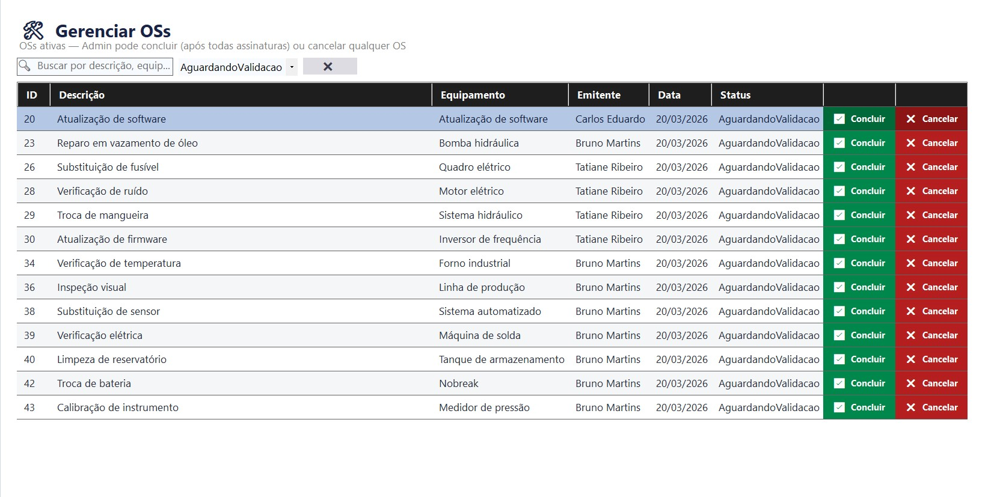
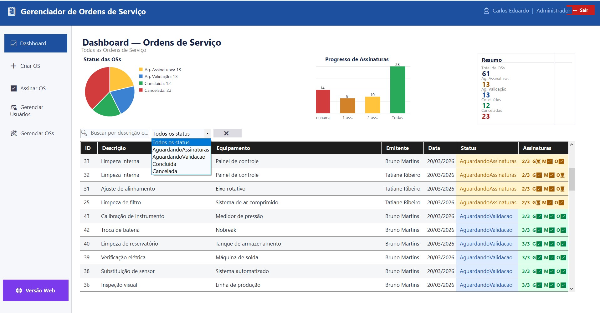
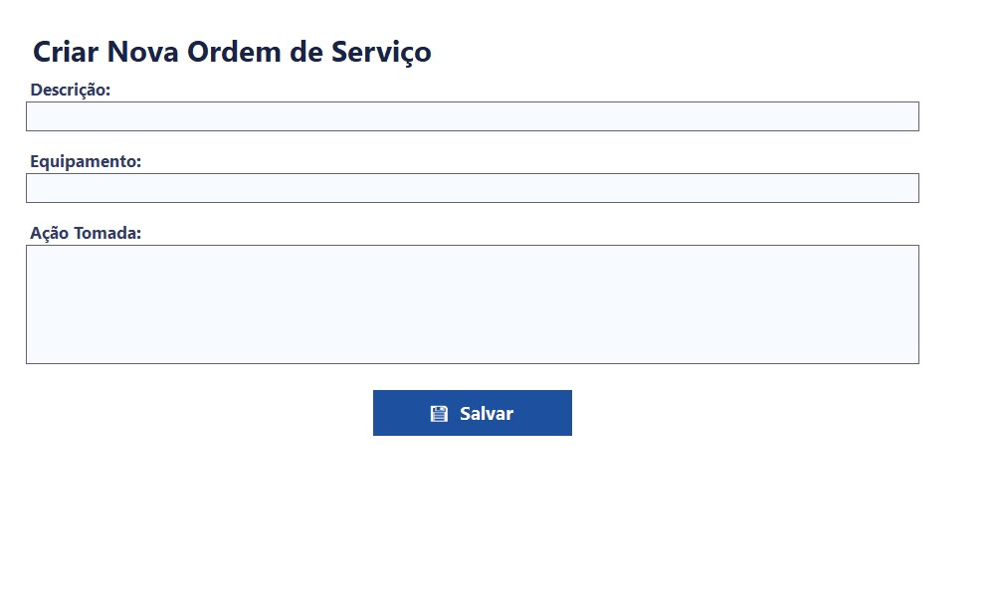

<div align="center">


# 🗂️ Gerenciador de Ordens de Serviço — OS

**Visibilidade total. Controle real. Melhoria contínua.**

[](https://learn.microsoft.com/dotnet/csharp/)
[](https://dotnet.microsoft.com/en-us/download/dotnet/8.0)
[](https://learn.microsoft.com/dotnet/desktop/winforms/)
[](https://www.microsoft.com/windows)
[]()
[](LICENSE)

</div>

---

## 📌 Sobre o Projeto

Em ambientes corporativos e industriais, **ordens de serviço sem controle visual significam retrabalho, atrasos e gargalos invisíveis.** Planilhas, e-mails e post-its não escalam — e a ausência de rastreabilidade custa caro.

O **OS (Gerenciador de Ordens de Serviço)** nasceu para resolver exatamente esse problema. É um sistema desktop moderno construído sobre **.NET 8 + Windows Forms**, com uma interface escura e responsiva, que centraliza toda a gestão de OS críticas em um único painel dinâmico.

O projeto aplica a filosofia **Kaizen** de melhoria contínua: cada iteração elimina um gargalo, automatiza uma rotina e entrega mais visibilidade para as equipes de Qualidade, Engenharia e Produção.

> **Para quem é?** Gestores de manutenção, coordenadores de produção, equipes de qualidade e qualquer time que precise de rastreabilidade e controle sobre suas demandas internas.

---

## 🖼️ Demonstração

<div align="center">

### Painel Principal — Listagem de OS


> *Visão geral das ordens em andamento com código de cores por urgência e paginação dinâmica.*

---

### Dashboard — Visão Executiva


> *Painel analítico com distribuição por status, setor emitente e indicadores de assinatura.*

---

### Novas Ordens


> *Formulário de criação e edição de OS com validação em tempo real.*

</div>

---

## ✨ Principais Funcionalidades

### 📋 Gestão de Ordens de Serviço
- 📄 **Listagem paginada** de todas as OS com carregamento eficiente via API REST
- 🔍 **Filtros avançados** por status (`Aberta`, `Em Andamento`, `Concluída`, `Cancelada`)
- 🎨 **Código de cores automático** por urgência e tempo de abertura da OS
- ✏️ **Criação, edição e exclusão** de ordens com formulário modal integrado
- 🔗 **Rastreabilidade completa** com campo de ação tomada e histórico de equipamento

### ✅ Fluxo de Assinaturas Multissetorial
- 🏭 Controle independente de assinatura por **Qualidade**, **Engenharia** e **Produção**
- 🔢 Contador visual de **total de assinaturas** por OS (`TotalAssinaturas`)
- 🔒 Bloqueio de edição para OS completamente aprovadas

### 📊 Dashboard Analítico
- 📈 Gráficos de distribuição por status e setor emitente
- 🕐 Visão rápida de OS abertas há mais tempo
- 📌 Indicadores de volume por emitente

### 👤 Administração de Usuários
- 🔑 **Controle de perfis** (Admin / Usuário padrão) com permissões diferenciadas
- 🏢 **Gestão de setores** com mapeamento entre labels de exibição e valores da API
- ➕ Criação, edição e remoção de usuários diretamente pelo painel Admin
- 🔐 Autenticação com e-mail e senha, com estado de sessão persistido localmente

### 🖥️ Experiência de Usuário
- 🌑 **Tema escuro moderno** com paleta de cores profissional (`#1E1E2E`, `#6C63FF`)
- 🧩 **User Controls reutilizáveis** (`UcListagemOS`) para carregamento assíncrono
- ⚡ Operações assíncronas com `async/await` para interface sempre responsiva
- 🔔 Feedback visual com mensagens de estado (carregando, erro, vazio)
- 🔄 **Auto-update** integrado via **Squirrel.Windows**

---


## 🛠️ Como Compilar e Executar

### Pré-requisitos

| Ferramenta | Versão Mínima | Link |
|---|---|---|
| Visual Studio | 2022 (17.x) | [Download](https://visualstudio.microsoft.com/) |
| .NET SDK | 8.0 | [Download](https://dotnet.microsoft.com/download/dotnet/8.0) |
| Git | Qualquer | [Download](https://git-scm.com/) |

### Clone e Execute

```bash
# 1. Clone o repositório
git clone https://github.com/seu-usuario/Gerenciador-de-Ordens-de-Servico.git

# 2. Acesse o diretório do projeto
cd Gerenciador-de-Ordens-de-Servico

# 3. Restaure os pacotes NuGet via CLI (opcional — o Visual Studio faz isso automaticamente)
dotnet restore
```

```bash
# 4. Compile e execute em modo Debug
dotnet run --project Gerenciador-de-Ordens-de_servico/Gerenciador-de-Ordens-de_servico.csproj
```

Ou abra a solution **`Gerenciador-de-Ordens-de_servico.sln`** diretamente no **Visual Studio 2022** e pressione `F5`.

### Pacotes NuGet Utilizados

| Pacote | Finalidade |
|---|---|
| `Squirrel.Windows` | Geração de instalador e sistema de auto-update |
| `SharpCompress` | Compressão/descompressão de pacotes `.nupkg` |
| `Mono.Cecil` | Dependência interna do Squirrel |
| `DeltaCompressionDotNet` | Delta updates eficientes entre versões |
| `System.Windows.Forms.DataVisualization` | Gráficos nativos no Dashboard |

### Gerando o Instalador

```powershell
# 1. Publique a aplicação em modo Release
dotnet publish -c Release -r win-x64 --self-contained

# 2. Empacote com NuGet (usando o pacote.nuspec)
nuget pack Gerenciador-de-Ordens-de_servico/pacote.nuspec

# 3. Gere o instalador com Squirrel
squirrel --releasify Gerenciador-de-Ordens-de_servico.*.nupkg --releaseDir=./Releases
```

> O `Setup.exe` e os arquivos de update estarão na pasta `./Releases`.

---

## 🏗️ Arquitetura e Código

```
Gerenciador-de-Ordens-de_servico/
├── Program.cs                   # Entry point — inicialização da aplicação
├── ApiConfig.cs                 # Singleton HttpClient + configuração de base URL
│
├── Form1.cs / Designer.cs       # 🏠 Tela principal — Shell com navegação lateral
│                                #    Contém: botões de menu, área de conteúdo dinâmico,
│                                #    lógica de highlight do botão ativo e roteamento de views
│
├── Form2.cs / Designer.cs       # 📋 Tela de Novas Ordens
│                                #    Exibe OS recentes e pendentes de ação
│
├── Form3.cs / Designer.cs       # 🔐 Tela de Login
│                                #    Autenticação via API REST, gestão de sessão
│
├── UcListagemOSC.cs             # 🧩 User Control — Componente de card de OS
│   UcListagemOSC.Designer.cs   #    Exibe: ID, descrição, equipamento, status,
│                                #    emitente, setor, assinaturas e ações (Ver/Editar)
│
├── Properties/
│   └── Resources.Designer.cs   # Assets embutidos (ícones, imagens)
│
└── pacote.nuspec                # Manifesto NuGet para geração do instalador Squirrel
```

### Padrões e Decisões Técnicas

**`UcListagemOSC` — User Control Reutilizável**
Cada OS é renderizada como um card individual via `UcListagemOSC`, carregado dinamicamente na `FlowLayoutPanel` da tela principal. Isso permite paginação eficiente e reuso de layout sem duplicação de código.

**`ApiConfig` — HttpClient Singleton**
Seguindo as [boas práticas da Microsoft](https://learn.microsoft.com/dotnet/fundamentals/networking/http/httpclient-guidelines), o `HttpClient` é instanciado uma única vez via propriedade estática em `ApiConfig.cs`, evitando o clássico problema de esgotamento de sockets.

**Async/Await em toda a camada de dados**
Todas as chamadas HTTP utilizam `async Task<T>`, garantindo que a UI nunca trave durante operações de rede — um requisito crítico em ambientes de produção.

**Modelos de dados espelham o contrato da API**
As classes `OscResponse` e `UsuarioResponse` são POCOs que mapeiam diretamente o JSON retornado pela API REST, com `JsonStringEnumConverter` para enums legíveis.

---

## 🤝 Como Contribuir

Contribuições são muito bem-vindas! Este projeto segue o fluxo padrão de colaboração open-source:

**1.** Faça um **Fork** do repositório

**2.** Crie uma branch para sua feature ou correção:
```bash
git checkout -b feature/minha-nova-funcionalidade
```

**3.** Faça suas alterações e escreva commits descritivos:
```bash
git commit -m "feat: adiciona filtro por data de emissão na listagem de OS"
```

**4.** Envie sua branch para o seu fork:
```bash
git push origin feature/minha-nova-funcionalidade
```

**5.** Abra um **Pull Request** descrevendo o problema resolvido e a solução implementada.

### Convenções

- Commits seguem o padrão [Conventional Commits](https://www.conventionalcommits.org/) (`feat:`, `fix:`, `docs:`, `refactor:`)
- Código em **C# com nomenclatura em português** (seguindo o padrão do projeto)
- Novas funcionalidades devem ser acompanhadas de atualização na documentação

### Reportando Bugs

Encontrou um problema? Abra uma [Issue](../../issues/new) com:
- Descrição detalhada do comportamento esperado vs. observado
- Passos para reproduzir
- Versão do sistema operacional e do OS

---

## 📄 Licença

Distribuído sob a licença **MIT**. Veja o arquivo [`LICENSE`](LICENSE) para mais detalhes.

---

